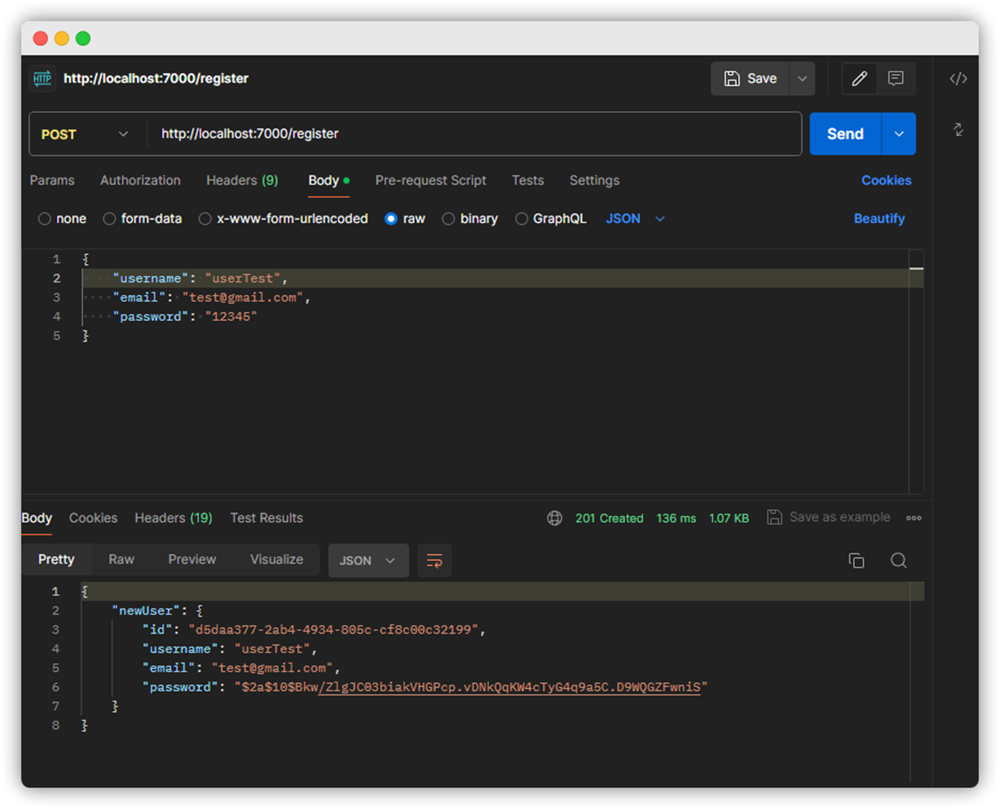
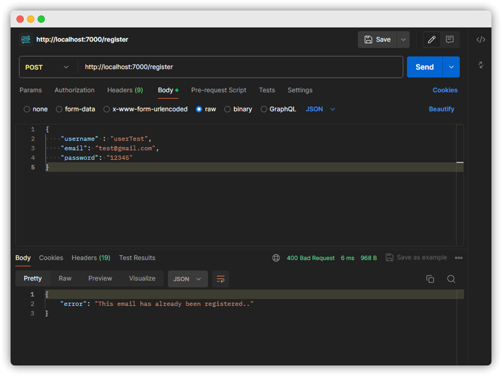
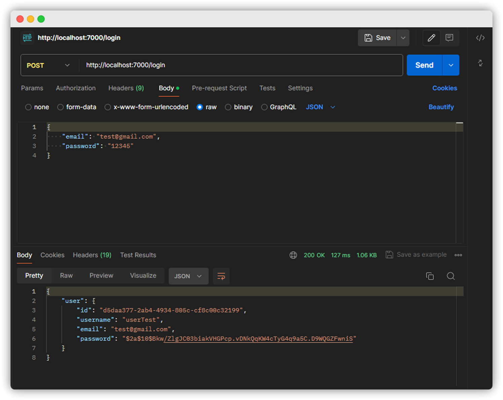
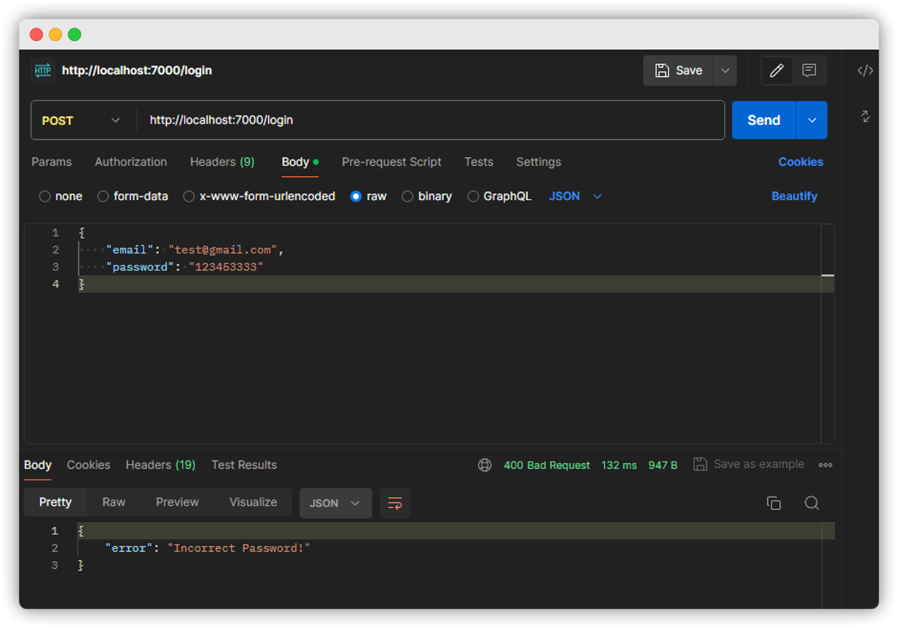

# dating-app-backend

## Description

This project is a backend system for a Dating Mobile App with functionalities similar to Tinder/Bumble.

## Structure

- `/src`: Source code
- `app`: Index

## How to Run

1. Install dependencies: `npm install`
2. Run the server: `npm run dev`

## Tech Stack

- **Language**: TypeScript (Node.js)
- **Database**: users.json (.json file)

## Functional Requirements

- User Sign Up
- User Login

## Non-Functional Requirements

- Scalability
- Security
- Performance
- Usability

## Postman Test

- Register users
  

- Duplicate user registration
  

- Login users
  

- Failed login due to invalid credentials
  
